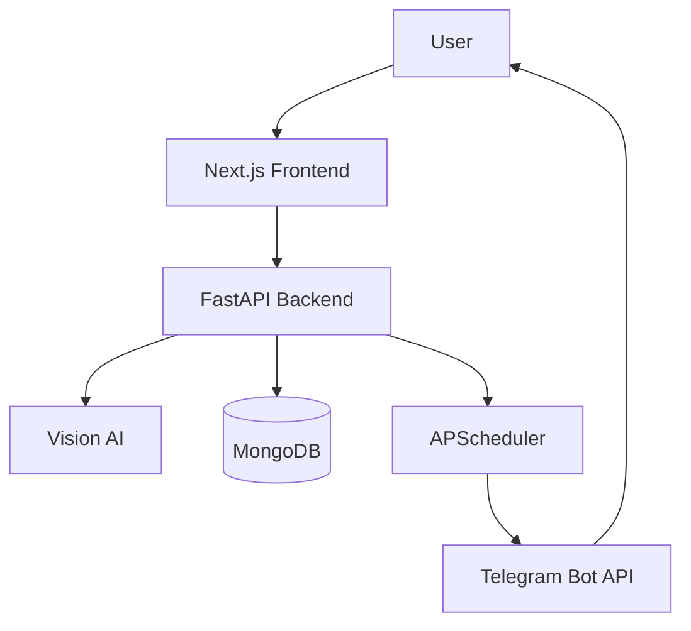

# MediRemind AI

MediRemind AI is an intelligent prescription reminder platform that converts prescription images into structured medication schedules and automatically reminds users to take their medicines through Telegram.

## Product Flow

```text
Prescription Image
        |
        v
   Vision AI
        |
        v
Medicine & Dosage Extraction
        |
        v
   Medication Schedule
        |
        v
    MongoDB
        |
        v
  Reminder Scheduler
        |
        v
 Telegram Notification
```

## Key Features

- Upload prescription images and automatically extract medicines, dosages, frequency, and duration.
- AI-powered prescription understanding using multimodal Vision AI.
- Automatically create medication schedules from extracted prescription data.
- Persistent medication storage using MongoDB.
- Automated background reminders using APScheduler.
- Deliver medication reminders directly through Telegram.
- Optional local AI inference through LM Studio for privacy-focused deployments.

## Architecture

MediRemind uses a decoupled frontend and backend architecture.



## Technology Stack

- Frontend: Next.js, TypeScript, Tailwind CSS
- Backend: FastAPI, Python
- Database: MongoDB with Motor
- AI: Groq Vision API with Qwen Vision
- Local AI: LM Studio
- Scheduling: APScheduler
- Notifications: Telegram Bot API

## Disclaimer

MediRemind AI is a medication reminder and prescription-assistance tool. AI-generated information should always be verified against the original prescription. It is not intended to diagnose conditions, prescribe medication, or replace professional medical advice.
