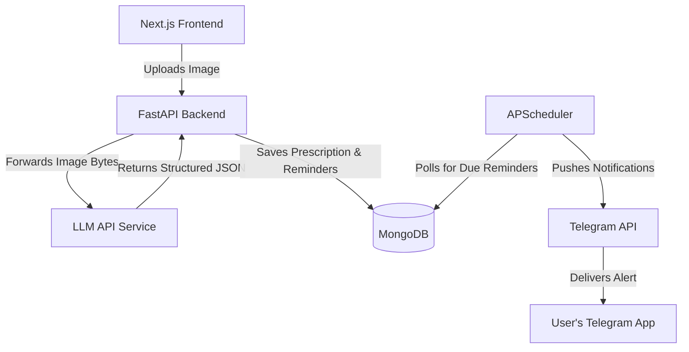

# MediRemind

MediRemind is an application that simplifies medication tracking. Users can upload an image of their medical prescription, and the system automatically extracts the medication details, schedules timings, and sends alerts via Telegram when it is time to take the medicine.

## Architecture Overview

The system is broken down into three main components: a Next.js frontend, a FastAPI backend, and an external LLM microservice for image processing.



### 1. Frontend
Built with Next.js 15, React, and Tailwind CSS. It provides the user interface for authenticating, uploading prescriptions via drag-and-drop, and managing active reminders from a dashboard.

### 2. Backend
Built with Python and FastAPI. It handles core application logic, authenticates users via JWT, stores data in MongoDB, and runs a background task using APScheduler. The scheduler continuously checks the database for reminders that are due and pushes notifications to the user's connected Telegram Chat ID.

### 3. LLM Service
To handle the optical character recognition and data extraction from prescription images, this project relies on a separate standalone microservice. 

You can find the service repository here: [Siddharth-Jaswal/LLM-SERVICE](https://github.com/Siddharth-Jaswal/LLM-SERVICE)

Rather than storing user images on the hard drive, the FastAPI backend holds the uploaded image temporarily in memory and passes it directly to this LLM service. The LLM service analyzes the image and returns a clean, structured JSON payload containing the medicine names, dosages, and food instructions, which is then parsed and saved to the database.

## Prerequisites

Before running the application, ensure you have the following installed on your machine:
- Node.js
- Python 3.x
- MongoDB (running locally on default port 27017)
- A Telegram Bot Token (obtained by talking to BotFather on Telegram)

You will also need to clone and run the LLM Service mentioned above.

## Setup and Configuration

### 1. Start the LLM Service
Clone the LLM-SERVICE repository and follow its specific instructions to get it running on your local machine. By default, the MediRemind backend expects this service to be accessible locally.

### 2. Configure the Backend
Navigate to the backend directory and set up the Python environment:

```bash
cd backend
python -m venv .venv
source .venv/Scripts/activate  # On Windows
pip install -r requirements.txt
```

Create a `.env` file inside the `backend` directory with the following variables:

```env
MONGODB_URL="mongodb://localhost:27017"
DATABASE_NAME="mediremind"
TELEGRAM_BOT_TOKEN="your_telegram_bot_token_here"
JWT_SECRET="generate_a_random_secret_string"
LLM_SERVICE_URL="http://localhost:8000/vision"
```

Start the backend server:
```bash
uvicorn app.main:app --reload --port 8001
```

### 3. Configure the Frontend
Open a new terminal, navigate to the frontend directory, and install dependencies:

```bash
cd frontend
npm install
```

Start the development server:
```bash
npm run dev
```

## Usage

1. Open your browser and navigate to `http://localhost:3000`.
2. Create an account or log in.
3. In the dashboard settings, connect your Telegram account by providing your Chat ID.
4. Upload a prescription image. The LLM service will extract the details.
5. Review the extracted medicines and save them.
6. The dashboard allows you to assign specific times for each medicine.
7. You will receive an automated Telegram message whenever a reminder is due.
